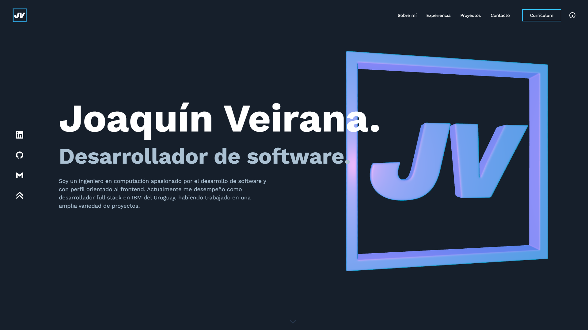

<div align="center">
  
</div>
<h1 align="center">
  JV Web Portfolio
</h1>
<p align="center">
    Este sitio fue desarrollado por Joaquín Veirana utilizando React, TypeScript, Next.js, Tailwind y Three.js.
</p>
<p align="center">
    El diseño está basado en el sitio web <a href="https://v4.brittanychiang.com/" target="_blank">v4.brittanychiang.com</a> creado por  <a href="https://brittanychiang.com/" target="_blank">Brittany Chiang</a>.
</p>

<p align="center">
    Para los objetos 3D renderizados por Three.js se utilizó como referencia el código del repositorio <a href="https://github.com/utsuboco/create-r3f-app" target="_blank">create-r3f-app</a> creado por Utsubo.
</p>

<p align="center">
    Para el efecto de texto de terminal de comandos en la sección principal fue tomado como referencia el ejemplo <a href="https://codepen.io/Tbgse/pen/dYaJyJTerminal" target="_blank">Terminal Text Effect</a> creado por @Tbgse.
</p>

<p align="center">
    Actualmente este sitio se encuentra desplegado en Vercel <a href="https://joaquinveirana.vercel.app/" target="_blank">acceder aquí</a>.
</p>

<div align="center">
  
</div>

## Instalación

1. Con Node.js instalado, ejecutar:

   ```
   npm i
   ```

2. Para ejecutarlo localmente:

   ```
   npm run dev
   ```
